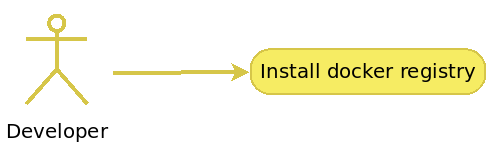
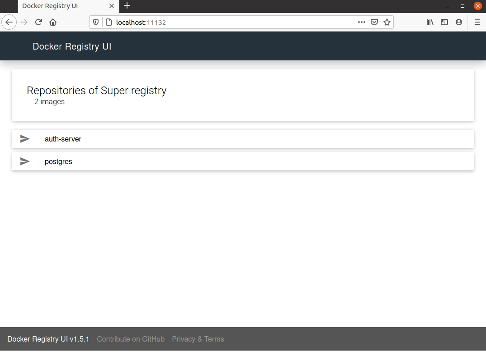
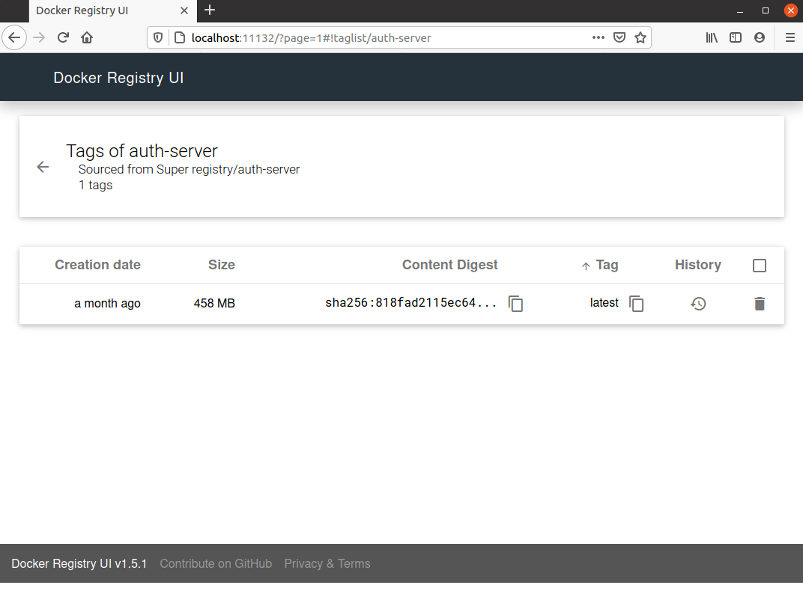
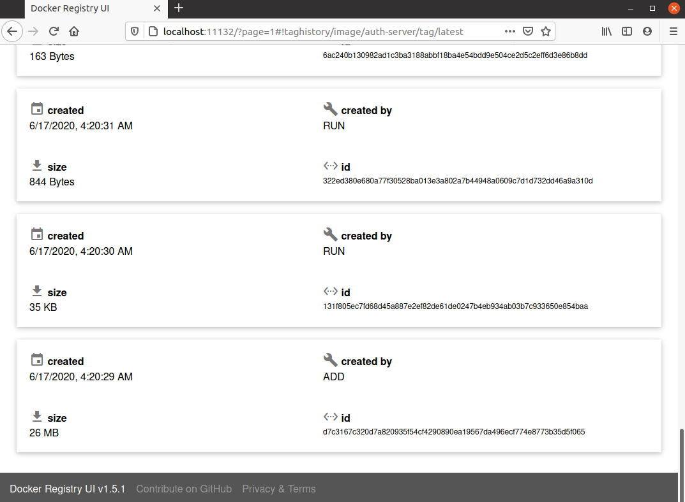

<div align="center">
    
</div>

# Intro
Docker registry + docker-registry-ui

---


# Use-cases
- As a developer I need quckly to setup a docker registry. I don't mind SSL or authentication.

<div align="center">
    
</div>

---


### Details
It's a docker-compose file containing next services:
```
$ docker-compose ps
    Name                  Command               State           Ports        
-----------------------------------------------------------------------------
dregistry      /entrypoint.sh /etc/docker ...   Up      0.0.0.0:80->5000/tcp 
dregistry_ui   /docker-entrypoint.sh ngin ...   Up      0.0.0.0:11132->80/tcp

```

---


### Cridentials
Here are no predefined cridentials as such.\
Still docker shall be configured to support unauthorized access(https://docs.docker.com/registry/insecure/). \
Create this file /etc/docker/daemon.json and append here:
```
{
    "insecure-registries" : ["dregistry:5000"]
}
```
Restart docker daemon:
```
$ sudo service docker restart
```

---


### Updating /etc/hosts
Here is a tool which uses docker events for updating /etc/hosts.\
Prior to launching docker-compose do this:
```
$ sudo apt update && sudo apt install jq
$ sudo bash ./docker-hosts-update.sh
```
Once this script is run it will append/remove entiries into /etc/hosts


#### Updating /etc/hosts(Option B)
```
$ echo "$(docker exec -it dregistry sh -c "hostname -i" | head -c-2) $(docker exec -it dregistry sh -c "hostname" | head -c-2)" | sudo tee -a /etc/hosts
```

---


### To launch
```
$ docker-compose up
```

---


### To shutdown
```
$ docker-compose down
```

---


### To push image to the regitry
```
$ docker tag <image> dregistry:5000/<image>:<tag>
$ docker push dregistry:5000/<image>:<tag>

```
Example:
```
$ docker tag auth-server dregistry:5000/auth-server:latest
$ docker push dregistry:5000/auth-server:latest
```

---


### To list all repos for regitry
```
$ curl -X GET http://dregistry:5000/v2/_catalog
```
Example:
```
$ curl -X GET http://dregistry:5000/v2/_catalog
{"repositories":["auth-server","ros-melodic"]}
```

---


### To list all tags for a repo
```
$ curl -X GET http://dregistry:5000/v2/<repo>/tags/list
```
Example:
```
$ curl -X GET http://dregistry:5000/v2/auth-server/tags/list
{"name":"auth-server","tags":["latest"]}
```

---


### To pull an image
```
$ docker pull dregistry:5000/<repo>:<tag>
```
Example:
```
$ docker pull dregistry:5000/auth-server:latest
```

---


### To cleanup volumes
```
$ docker volume rm dev_factory_dregistry_dregistry-data
```

---


### Web services
- [localhost:11132](http://localhost:11132)

---


### Screenshots

#### Repositories list
<div align="center">
    
</div>


#### Repository tags
<div align="center">
    
</div>


#### Repository history
<div align="center">
    
</div>

